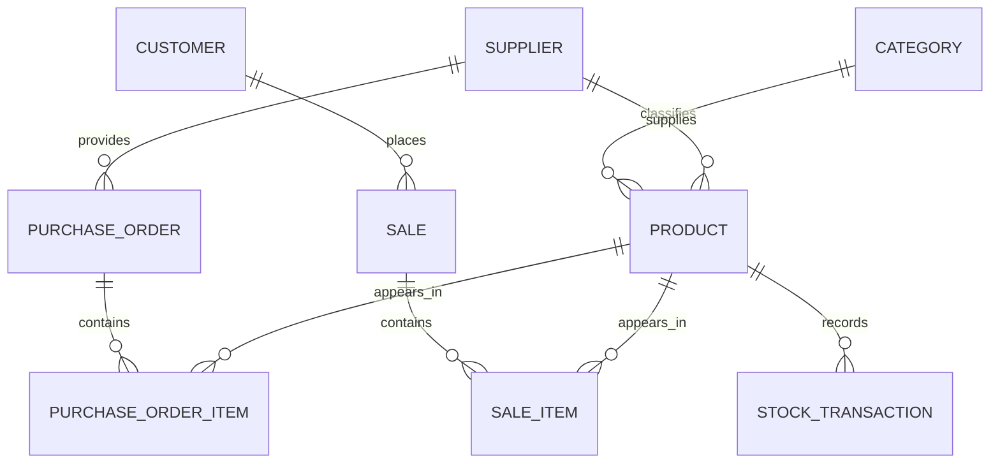

# Inventory Management System Database Design

This design is adapted for Firebase Firestore and uses a document-based structure with collections and subcollections instead of relational tables.

## Design goals
- Firebase Firestore compatible
- Flexible document-based schema
- 3NF-style normalization through references and subcollections
- snake_case field names in documents
- Timestamp fields for created and updated tracking

## Core collections
- categories/{categoryId}
- suppliers/{supplierId}
- products/{productId}
- customers/{customerId}
- sales/{saleId}
- sales/{saleId}/items/{itemId}
- purchaseOrders/{purchaseOrderId}
- purchaseOrders/{purchaseOrderId}/items/{itemId}
- stockTransactions/{stockTransactionId}

## Entity relationships
- One category has many products.
- One supplier has many products and purchase orders.
- One product belongs to one category and one supplier.
- One customer can place many sales.
- One sale can contain many sale items in a subcollection.
- One purchase order can contain many purchase order items in a subcollection.
- One product can appear in many sale items, purchase order items, and stock transactions.

## Mermaid ER diagram

## Collection explanations
- categories: stores product groupings such as Kids Wear or Accessories.
- suppliers: stores vendor information.
- products: stores item master data, including pricing and reorder level.
- customers: stores buyer information.
- sales: stores the sales header document for each transaction.
- sales/{saleId}/items: stores each product line within a sale.
- purchaseOrders: stores the purchase order header document.
- purchaseOrders/{purchaseOrderId}/items: stores each product line within a purchase order.
- stockTransactions: stores inventory movements such as inbound stock, outbound stock, and adjustments.

## Notes
- Monetary values can be stored as numbers in cents or as strings if you want exact decimal precision.
- createdAt and updatedAt are present on every document.
- The structure avoids duplicate data by using references and subcollections instead of repeating repeated transaction details in the parent documents.
